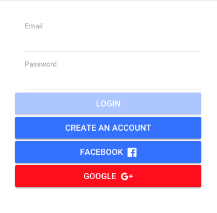
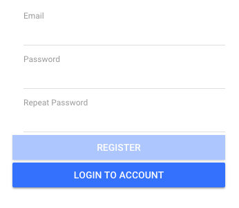

## CAP AUTHENTICATION

This module implements ionic complements but maybe in future releases, we could implement bootstrap.

CAP AUTHENTICATION it's a module that provides: 
* registration
* login
* change password

This module implements ionic complements but maybe in future releases, we could implement bootstrap.

## Installation Authentication module

```
npm i cap-authorization
```
---

## Configuration
Add the module into the app module or into the module that you want to implement this module after that write your credentials. 

```
import { AuthenticationModule } from 'cap-authorization'
```
---


into the import section
```
AuthenticationModule.forRoot({
      apiUrl: 'your-apiUrl',
      loginEndpoint: 'your-user',
      facebookId: 'your-facebook-id',
      googleId: 'your-google-id',
    }),
```
--- 

## Login Component
The login component implement [angular5-social-login](https://github.com/sabyasachibiswal/angular5-social-login) for login with social media (Facebook and Google +).
Into the module of Authentication write your credentials of Facebook and Google +.

### Facebook credentials
For use the facebook login you have to create an account in [Facebook for developers](https://developers.facebook.com/apps/) and add a new application.

### Google credentials
Like Facebook you have to create an account in [Google for developers](https://developers.google.com/identity/sign-in/web/sign-in) and add a new product or service.


## Tags

### auth-app-login
The tag or selector auth-app-login provides an interface with two inputs and four buttons. 

Example
```
<h1>Login</h1>
<auth-app-login></auth-app-login>
```



### auth-app-login
The target or selector auth-app-change-password provides an interface with two inputs and two buttons.

Example
```
<h1>Change password</h1>
<auth-app-change-password></auth-app-change-password>
```


### auth-app-register
The target or selector auth-app-register provides an interface with two inputs and two buttons.

Example
```
<h1>Register</h1>
 <auth-app-register></auth-app-register>
```



## Services

If you want yo get the information of the user login with Facebook or Google you could use the getUserData method. This method is inside of the Authentication service and returns an object with the data of the social media.


## Implementation into a module

For use this module go to app module and into the sections of import put the authentintication module.

``` import { CapAuthentication } from 'cap-authorization'; 
        ...
    imports: [
        AuthenticationModule.forRoot({
            apiUrl: 'http://localhost:3000', // API Url
            loginEndpoint: 'users'  // [users or admin] endPoint in Loopback (for http://localhost:3000/users/login)
            
        })
    ]
    ...
```
---


## import the authentication services to use in a component:

``` 
import { AuthenticationService } from './services/authentication.service';
...
constructor(private authenticationService: AuthenticationService) {
    this.authenticationService.isAuthenticated());
} 
```
---


## Exposed Methods

This method returns a Boolean value with the value isLoggedIn

```isAuthenticated()```

Receive a credentials interface

```login(values: CredentialsInterface)``` 

If is a login success set the token and isLoggedIn in localstorage and variable isLoggedIn as true.

``` (email: string and password: string) ```

Remove token and isLoggedIn from localStorage and the variable isLoggedIn set to false.

``` logout(): void ```

---


## Component Selectors
Each component refers to selectors.

auth-app-login

```
    @Output()
    submit: EventEmitter<any> = new EventEmitter();

    @Output()
    changePage: EventEmitter<boolean> = new EventEmitter();
```

auth-app-register

``` 
    @Output()
    submit: EventEmitter<any> = new EventEmitter();
    
    @Output()
    changePage: EventEmitter<boolean> = new EventEmitter(); 
```

auth-app-change-password

```
    @Output()
    submit: EventEmitter<any> = new EventEmitter();

    @Output()
    changePage: EventEmitter<boolean> = new EventEmitter();
```
---


More information [HERE](https://www.npmjs.com/package/authmodule-angular6-module-example)
