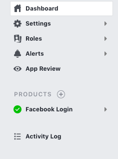

## CAP AUTHENTICATION


This module contains 3 services, such as: 
* registration
* login
* change password


## Installation Authentication module
```
npm i cap-authorization
```
---


## Configuration
Add the module into your principal module, after that write your credentials.

Example:
```
AuthenticationModule.forRoot({
    apiUrl: 'your-api-url',
    loginEndpoint: 'your-end-point'
})
```
---


## Login Component
The login component implement [angular5-social-login](https://github.com/sabyasachibiswal/angular5-social-login) for login with social media (Facebook and Google +).
Into the module of Authentication write your credentials of Facebook and Google +.

### Facebook credentials
For use the facebook login you have to create an account in [Facebook for developers](https://developers.facebook.com/apps/) and add a new application.


Write your credentials (name of project and email).

After that, go to the new application and product's section and add the login with Facebook.



## Implementation into a module

For use this module go to app module and into the sections of import put the authentintication module.

``` import { CapAuthentication } from 'cap-authorization'; 
        ...
    imports: [
        AuthenticationModule.forRoot({
            apiUrl: 'http://localhost:3000', // API Url
            loginEndpoint: 'users'  // [users or admin] endPoint in Loopback (for http://localhost:3000/users/login)
            
        })
    ]
    ...
```
---


## import the authentication services to use in a component:

``` 
import { AuthenticationService } from './services/authentication.service';
...
constructor(private authenticationService: AuthenticationService) {
    this.authenticationService.isAuthenticated());
} 
```
---


## Exposed Methods

This method returns a Boolean value with the value isLoggedIn

```isAuthenticated()```

Receive a credentials interface

```login(values: CredentialsInterface)``` 

If is a login success set the token and isLoggedIn in localstorage and variable isLoggedIn as true.

``` (email: string and password: string) ```

Remove token and isLoggedIn from localStorage and the variable isLoggedIn set to false.

``` logout(): void ```

---


## Component Selectors
Each component refers to selectors.

auth-app-login

```
    @Output()
    submit: EventEmitter<any> = new EventEmitter();

    @Output()
    changePage: EventEmitter<boolean> = new EventEmitter();
```

auth-app-register

``` 
    @Output()
    submit: EventEmitter<any> = new EventEmitter();
    
    @Output()
    changePage: EventEmitter<boolean> = new EventEmitter(); 
```

auth-app-change-password

```
    @Output()
    submit: EventEmitter<any> = new EventEmitter();

    @Output()
    changePage: EventEmitter<boolean> = new EventEmitter();
```
---


More information [HERE](https://www.npmjs.com/package/authmodule-angular6-module-example)
